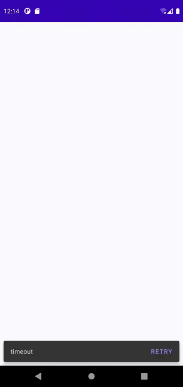
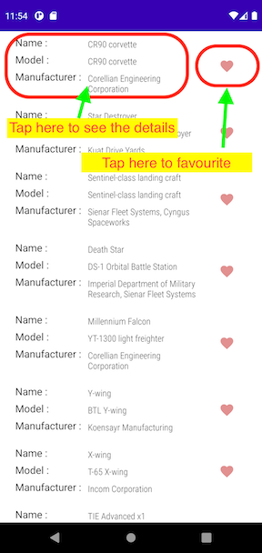

# Starships
Table of content
- [Overview](#overview)
- [Requirements](#requirements)
- [Usage](#usage)
- [Technologies and libraries used](#technologies_and_libraries_used)
- [Standards](#standards)
- [Implementation decisions and compromises](#implementation_decisions_and_compromises)
- [Tests](#tests)
- [Ackowledgement](#acknowledgement)

## Overview
Starship app is developed by Phyo (Billy) Hlaing according to requirements specified by Transurban coding challenge. It displays a list of starships, lets
user select their favourites and view detailed description of a starship

## Requirements
Please see the requirements [here](https://github.com/bhlaing/Starships/blob/master/coding_challenge.pdf)

## Usage
- Tap on Cell area to navigate to description
- Tap on the heart to make a starship as favourite (Favourite spaceships are set to Alpha 1.0 and regular ones are set to Alpha 0.5
- When there is an error retrieving starships a snack bar will be displayed. Tap on Retry to refresh the screen

## Technologies and libraries used
App uses 100% kotlin, Architecture components, Coroutines, Retrofit2, Mockito

## Standards
**Styles**
- Activity,Fragment titles --> SpaceShipApp.Text.PageTitle  
- Paragraphs --> SpaceShipApp.Text.Paragraph  
- List titles, Buttons, Tabs --> SpaceShipApp.Text.Title  
- List item titles, Important text snippets --> SpaceShipApp.Text.ItemTitle  
- Secondary text, captions --> SpaceShipApp.Text.Captions  

**Layouts**
- Activity names has **activity_** surfix  
- Custom views has **view_** surfix  

**Model naming**
- Data objects are surfixed with **xxxDO**
- Domain objects has no prefix nor surfix
- Presentation objects are sufixed with **xxItem**

## Implementation decisions and compromises
**Architecture**
- A clear seperation between Presentation, Domain, Data layers is achieved by clean architecture
- MVVM to utilise architecture component support and coroutines. Also to allow scaling into 1 to many relationship between View and ViewModel
- Preferences currently sits in _ui_ packange _shared_ folder with assumption to keep it purely as presentation logic

**Favourite implementation**
- VM is refreshed whenever the activity is resumed to reflect preference changes and to keep the implementation simple. We can consider caching the spaceships in the Service to optimise this

**Sorting and others**
- For this project, no sorting is implemented. Recommended implementation approach as below
- Sorting preference can be stored and managed by user preference service if we choose to have one. Consider usecases to isolate each sorting logics and unit test

**Exceptions**
- All exceptions are mapped to StarShipException and are delivered to UI in a form of message
- Generally, exceptions can be broken down into Critical and Non-critical. Non-Critical errors are handled and feedbacked to user and Critical errors  restart/terminate session

## Tests
- Tested for screen scaling Large font, Large display 
- Unit-tests for ViewModel/PreferenceManager to demonstrate testing techniques
- Consider testing Main to Description flow with espresso. Recommends Screen/Robot pattern
- Consider testing Mappers
## Acknowledgement
I would like to thank	David Duieb, Geoff Montgomery, Alexander Gvozdik,Joel Schmidt and Stephanie Futerman for providing me with this opportunity
